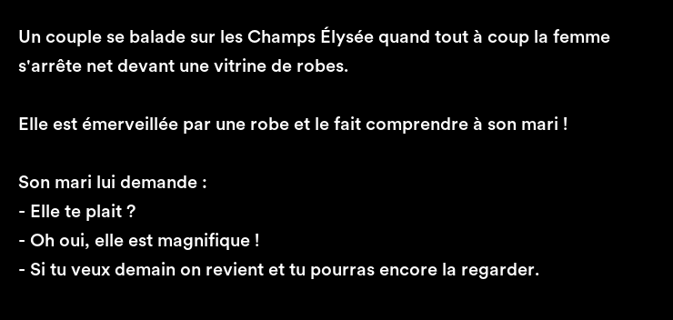

# LOL42 (Tokenizer)

This project, known as **Tokenizer**, is part of the Ecole 42 curriculum. It aims to deepen understanding of the blockchain ecosystem by creating innovative digital assets.

## Overview

`LOL42` is an **NFT project** developed using **Solidity** and the **Hardhat** framework. The NFT token represents ownership of a joke, with each token containing an image of the joke along with attributes such as the author and language. This project aims to bring humor to the NFT space, allowing individuals to prove ownership and potentially sell their unique jokes.

## Project Structure

- `/contracts`: Solidity smart contracts defining the LOL42 token.
- `/test`: Automated tests to ensure the smart contracts function correctly.
- `/ignition`: Deploy scripts code.
- `/documentation`: Documentation of LOL42.

## Key Decisions and Reasoning

### Solidity

Solidity is the most widely used language for writing smart contracts on the Ethereum blockchain. It offers robust tools and a large community, making it a reliable choice for developing secure and efficient smart contracts.

### Hardhat

Hardhat provides a flexible and powerful environment for Solidity development. It offers excellent debugging tools, plugin support, and an easy setup for testing and deployment. This made it the ideal choice to streamline the development process.

### IPFS and Pinata

**IPFS** (InterPlanetary File System) is a decentralized storage protocol that ensures data is distributed across a network of nodes, rather than being held in a single centralized server. This offers several key benefits for the LOL42 NFT project:

- Decentralization: Enhances security and resilience by preventing data from being a single point of failure.
- Immutability: Once uploaded, the data cannot be altered, ensuring the integrity and authenticity of the NFT content over time.
- Content Addressing: Data is accessed via a unique hash, making it easy to verify and retrieve specific files.

**Pinata** is a popular IPFS pinning service that ensures your files remain available and accessible over time.

### Token Attributes

**Decision**: Including "author" and "language" attributes in the NFT token.

**Reasoning**: These attributes add value to the NFT by providing additional context and metadata. The "author" attribute allows for recognition of the joke's creator, while the "language" attribute ensures that the joke can be categorized and understood in its intended linguistic context. This enhances the uniqueness and authenticity of each token.

## Related Links

- [LOL42 documentation](https://woolimi.github.io/LOL42-Tokenizer)
- [Sepolia Lol42 Contract](https://sepolia.etherscan.io/address/0xB6547E90406447A8eA2Dc5BdBaDD016AB066aBd4)
- [LOL42 Opensea testnet](https://testnets.opensea.io/fr/collection/lol42-1)
