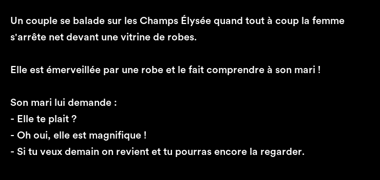

# LOL42

## Introduction

- [Sepolia Lol42 Contract](https://sepolia.etherscan.io/address/0xB6547E90406447A8eA2Dc5BdBaDD016AB066aBd4)
- [Lol42 Opensea testnet](https://testnets.opensea.io/fr/collection/lol42-1)

`LOL42` is an **NFT project** developed using **Solidity**. The token represents ownership of a joke, with each token containing an image of the joke along with attributes such as the author and language. This project aims to bring humor to the NFT space, allowing individuals to prove ownership and potentially sell their unique jokes.

## ERC721

The `LOL42` token adheres to the `ERC721` standard. `ERC721` is a widely accepted standard for non-fungible tokens (NFTs) on the Ethereum blockchain. By conforming to the `ERC721` specification, the `LOL42` token ensures compatibility with a broad range of NFT platforms, marketplaces, and wallets.

## Project Purpose

This project has been created for educational purposes to study the Ethereum ecosystem, Solidity, and NFTs. It is not intended for actual deployment. The primary goal is to provide hands-on experience and deepen understanding of blockchain technology and smart contract development.
